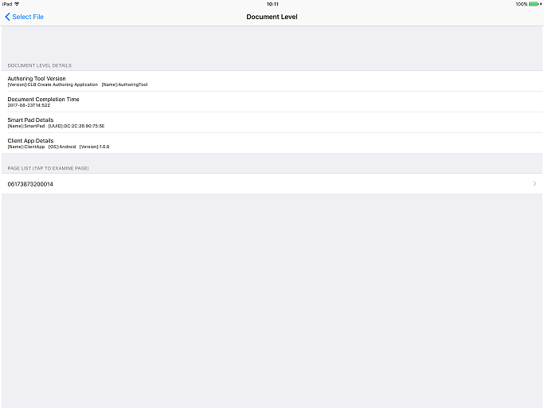
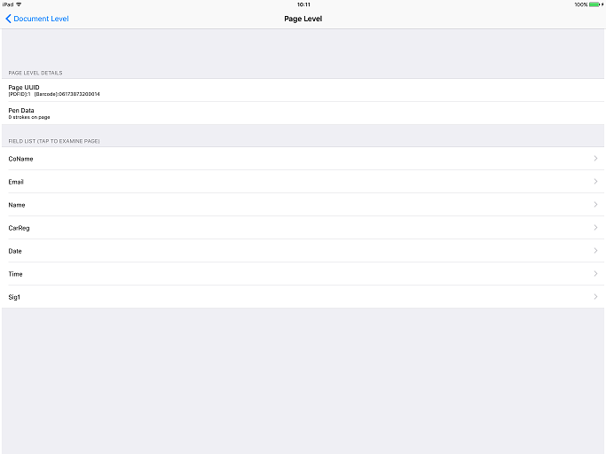
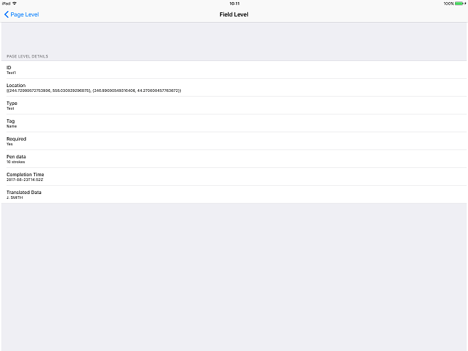

# Getting Started 

## Development Environment

The *Wacom Ink SDK for documents* requires Swift 4.0.2 / Xcode 9.1

## Download the Wacom Ink SDK for documents

Download the SDK from https://developer.wacom.com/developer-dashboard

* Login using your Wacom ID
* Select **Downloads for documents**
* Download **Wacom Ink SDK for documents for iOS**
* Accept the End User License Agreement to use the SDK

The downloaded Zip file contains the SDK with documentation.

## Download an Evaluation License

A license is needed to use the SDK and a fully functional evaluation license is free to download as follows:

* Navigate to https://developer.wacom.com/developer-dashboard
* login using your Wacom ID
* Select **Licenses**
* Select **New Evaluation License**
* Select **Generate Evaluation License** for Wacom Ink SDK for documents
* Return to Licenses where the new license file is ready for download
* Download the license file

The license is supplied as a JWT text string in a text file.
This will need to be copied into your application.
The self-service evaluation licenses have a three-month expiry date from the time of creation.
However you can generate a new license at any time. 

----
## Sample Code

A sample project is provided to assist with new development.

Build the sample to view the XMP contents of a PDF document.
A demonstration file `BaxterSample.pdf` is included with the sample, it contains fields created using the Wacom Ink SDK for documents.
Open a document then navigate the page and field contents, for example:

      

  

----

